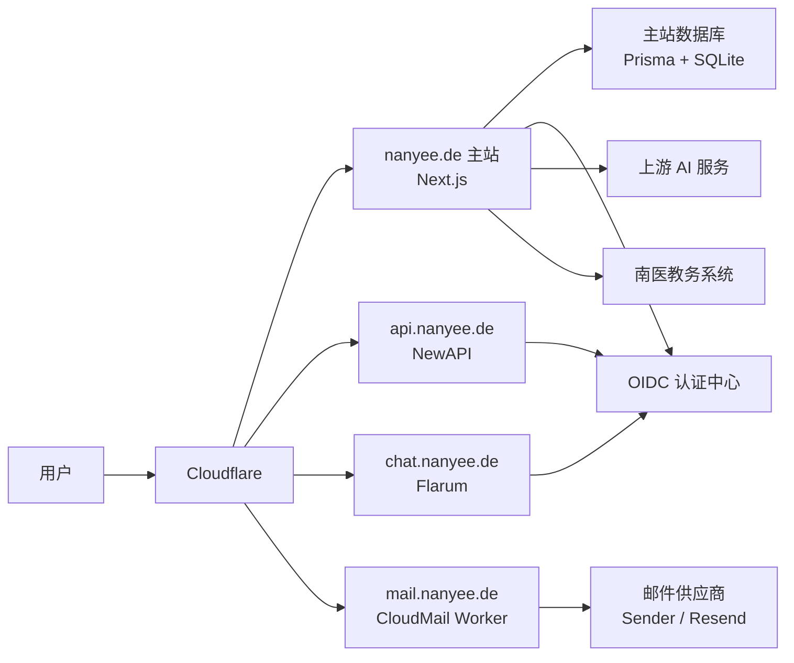

# Nanyee 项目架构简明说明

> 适合读者：刚开始接触全栈项目的学生开发者  
> 目标：快速看懂这个项目里“每个部分是干什么的”

---

## 1. 先用一句话理解整个项目

这个项目不是单独一个网站，而是一个**以主站为中心、带多个外部子系统的校园平台**。

- `nanyee.de`：主站，负责页面、账号、知识库、AI、校园工具
- `api.nanyee.de`：API 平台，负责模型接口和控制台
- `chat.nanyee.de`：论坛，负责讨论交流
- `mail.nanyee.de`：邮件系统，负责验证码和邮件发送

其中最关键的一点是：

**主站负责“统一身份”，别的系统通过主站完成登录。**

---

## 2. 总体架构图

### 这张图怎么理解

- 用户先访问 Cloudflare
- Cloudflare 再把请求分发到主站、API 站点、论坛或邮件系统
- 主站不仅负责自己的页面，也负责统一登录
- API 站点和论坛都依赖主站的 OIDC 登录
- 主站还会连接上游 AI 服务和学校教务系统

---

## 3. 主站 `nanyee.de`

### 作用

主站是整个项目的核心入口，主要负责：

- 用户登录、注册、会话管理
- AI 对话首页
- 知识库 / Wiki
- 校园工具入口
- 后台管理
- 给其他系统提供 OIDC 登录

### 原理

主站是一个 Next.js 项目。

- 页面代码放在 `src/app`
- API 接口也放在 `src/app/api`
- 公共业务逻辑放在 `src/lib`
- 数据通过 Prisma 访问数据库

可以把主站理解成：

**前台页面 + 后台接口 + 统一认证中心，三者合在一起。**

---

## 4. API 站点 `api.nanyee.de`

### 作用

API 站点负责：

- 提供统一模型接口
- 管理 API Key
- 提供控制台页面
- 让用户在一个地方管理模型调用

### 原理

API 站点本身不是主站的一部分，它是独立运行的 NewAPI 服务。

它有两类核心能力：

- **自己的业务能力**：控制台、模型渠道、令牌管理
- **借用主站的身份能力**：通过 OIDC 向主站申请登录

所以它的设计思路是：

**API 平台自己管“接口业务”，主站管“你是谁”。**

---

## 5. 论坛 `chat.nanyee.de`

### 作用

论坛负责：

- 发帖
- 回复
- 讨论
- 形成社区内容

### 原理

论坛用的是 Flarum，它不是 React/Next.js 页面，而是一个独立论坛程序。

论坛的内容数据保存在它自己的数据库里，但登录不自己单独做一套，而是走主站的 OIDC。

可以把论坛理解成：

**内容系统独立，身份系统统一。**

---

## 6. CloudMail `mail.nanyee.de`

### 作用

CloudMail 主要负责：

- 发送验证码邮件
- 发送系统邮件
- 做邮件网关

### 原理

CloudMail 不是跑在主站里的一个页面，而是一个 Cloudflare Worker 服务。

它的工作方式大概是：

1. 主站发请求给 CloudMail
2. CloudMail 判断邮件类型
3. CloudMail 再调用邮件供应商，比如 Sender 或 Resend

所以它更像一个“邮件中转站”，而不是“普通网页功能”。

---

## 7. Cloudflare

### 作用

Cloudflare 主要负责：

- 域名解析
- HTTPS / TLS
- CDN 和代理
- 托管 Worker（比如 CloudMail）

### 原理

用户并不是直接连到 VPS，而是先经过 Cloudflare。

这样做的好处是：

- 统一域名入口
- HTTPS 更方便
- 某些服务可以直接放到 Cloudflare 上
- 外部访问更稳定

所以 Cloudflare 在这里更像“总入口”和“边缘层”。

---

## 8. VPS

### 作用

VPS 主要负责跑那些不能直接放在 Cloudflare Worker 上的服务，比如：

- 主站 Next.js
- API 站点 NewAPI
- Flarum 论坛
- 数据库或本地文件

### 原理

在 VPS 里，大致是这种结构：

- Nginx 作为入口代理
- 主站作为一个 Next.js 服务运行
- NewAPI 作为一个容器运行
- Flarum 作为一个容器运行

所以 VPS 更像是：

**实际运行后端服务的主机。**

---

## 9. 数据库怎么分

这个项目不是“所有数据都放一个库”。

### 主站数据库

主要存：

- 用户
- Session
- 知识库文章
- 评论
- OIDC 授权相关数据

### API 站点数据库

主要存：

- API Key
- 渠道配置
- 模型接口相关数据

### 论坛数据库

主要存：

- 帖子
- 回复
- 论坛用户资料

### CloudMail 的数据

主要存：

- 邮件元数据
- 邮件内容或附件引用

所以这里的原则是：

**谁负责这个业务，数据就主要归谁管理。**

---

## 10. 代码目录分别是干什么的

下面这些目录最重要：

| 目录 | 作用 | 原理 |
| --- | --- | --- |
| `src/app` | 页面和 API 路由 | Next.js 的页面层和接口层都在这里 |
| `src/lib` | 业务逻辑 | 把真正的逻辑从页面里拆出去，避免页面文件过重 |
| `src/components` | UI 组件 | 页面里的按钮、卡片、编辑器、评论区都在这里复用 |
| `prisma` | 数据模型和迁移 | 用 schema 描述数据库结构，用 migration 管理变更 |
| `public` | 静态文件 | 放图标、模型文件、静态 HTML 等 |
| `tools` | 工具子项目 | 存放校园工具的独立实验代码和辅助工程 |
| `deploy` | 部署配置 | 放论坛、NewAPI 等外部系统的部署文件 |
| `docs` | 文档 | 记录设计、部署和项目说明 |

---

## 11. 登录系统的基本原理

### 作用

让用户在主站登录，并且把这个身份共享给 API 站点和论坛。

### 原理

登录分成两层：

#### 第一层：主站自己的登录

- 用户输入用户名和密码
- 主站验证成功后发 cookie
- 后续请求通过 cookie 识别用户

#### 第二层：OIDC 单点登录

- API 站点或论坛需要登录时，跳去主站
- 主站确认用户身份
- 主站返回授权结果
- API 站点或论坛拿到用户信息后完成本地登录

所以这里的核心思想是：

**主站统一验证身份，别的系统复用这个身份。**

---

## 12. AI 聊天的基本原理

### 作用

给用户提供聊天入口，并且可以调用知识库和工具。

### 原理

AI 对话不是简单把一句话发给模型，而是大概会经过这些步骤：

1. 收到用户消息
2. 选择模型和上游 key
3. 发给上游模型
4. 如果模型需要工具，就执行工具
5. 把工具结果再发回模型
6. 用流式返回结果给前端

这里的关键点是：

- AI 不只是“回答问题”
- 它还能“调用工具”
- 所以它像一个“调度器”

---

## 13. 知识库 / Wiki 的基本原理

### 作用

知识库负责沉淀校园经验、文章、攻略和评论。

### 原理

它的思路不是只存一篇文章当前内容，而是拆成几个层次：

- `Article`：当前版本
- `ArticleRevision`：历史版本
- `Comment`：评论

这意味着：

- 页面看到的是当前版本
- 回滚和历史查看依赖 revision
- 评论不直接写进正文，而是单独管理

所以知识库本质上是一个**轻量 Wiki + 版本系统**。

---

## 14. 校园工具的基本原理

### 作用

校园工具负责：

- 课表导出
- 成绩查询
- 自动选课
- 验证码识别

### 原理

这些工具并不是查自己数据库，而是要和学校教务系统交互。

所以核心逻辑通常是：

1. 拿验证码
2. 登录教务系统
3. 带着 cookie 请求学校接口
4. 解析结果
5. 返回给前端

这也是为什么工具这块和普通内容页不一样，它更像“自动化脚本 + Web 接口”的结合。

---

## 15. 为什么仓库里还有 `tools/`

### 作用

`tools/` 可以理解成一个工具实验区或独立子项目。

### 原理

主站里的工具功能是“正式入口”，而 `tools/` 里还保留了：

- 单独工具页面
- 验证码模型训练相关代码
- 代理脚本
- 更偏实验性质的实现

所以阅读时可以这样区分：

- 想看线上主流程：先看 `src/app/api/tools`
- 想看工具底层实验和扩展：再看 `tools/`

---

## 16. 给新手的阅读顺序

如果你是第一次接手，建议按下面顺序看：

1. `src/app/layout.tsx` 和 `src/middleware.ts`  
   先理解请求是怎么进来的

2. `src/app/api/auth/*` 和 `src/lib/auth/*`  
   再理解登录、Session、权限

3. `src/app/api/oauth/*`  
   再理解为什么 API 站点和论坛能共用登录

4. `src/app/api/ai/chat/route.ts` 和 `src/lib/ai/*`  
   看 AI 对话怎么工作

5. `src/app/api/wiki/*` 和 `src/lib/wiki/*`  
   看知识库怎么工作

6. `src/app/api/tools/*` 和 `src/lib/*工具相关文件*`  
   最后看校园工具

这个顺序的原因很简单：

**先看通用骨架，再看具体功能。**

---

## 17. 最后的总结

这个项目最重要的架构思想只有两句：

1. **主站是中枢，负责统一入口和统一身份**
2. **API、论坛、邮件、工具系统各自独立，但通过主站协作**

只要先抓住这两点，再去看目录和代码，整个项目就不会显得乱。

