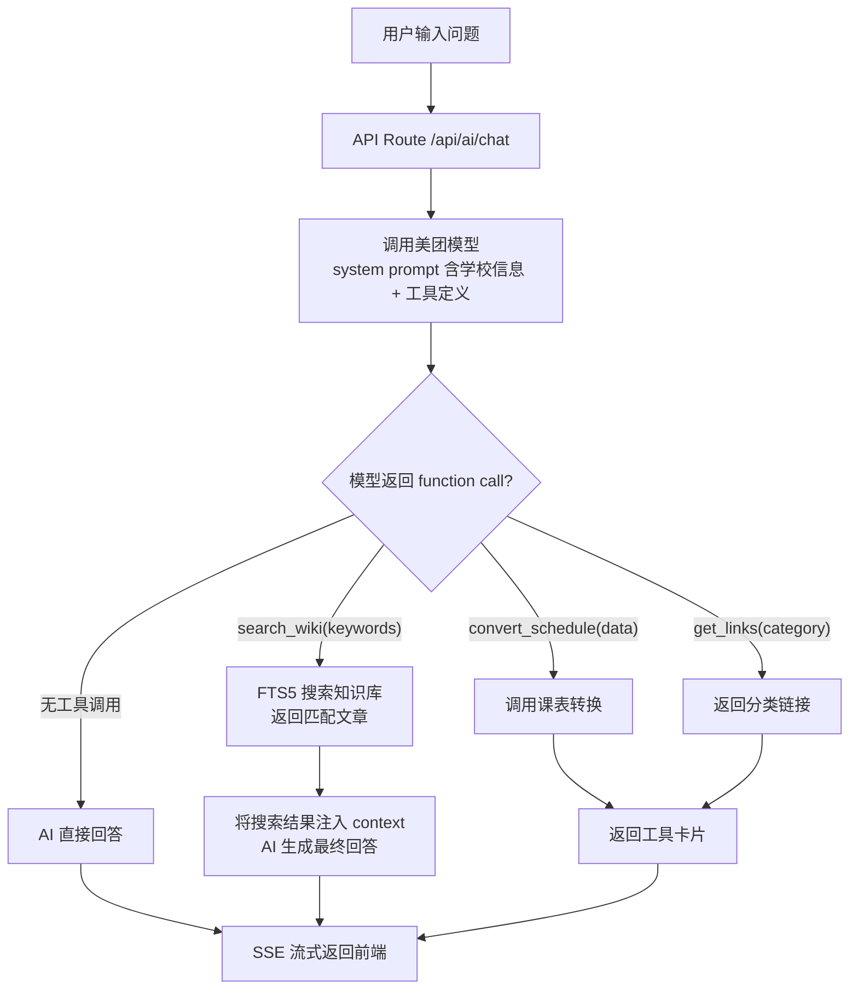
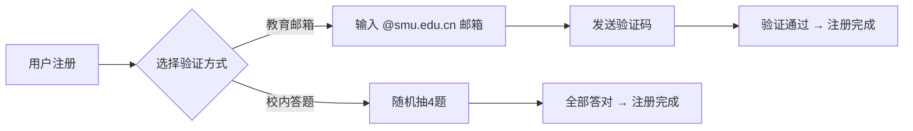

# nanyee.de — 南医的 AI Agent

> **定位**：以 AI 搜索为入口的校园工具平台。首页就是一个对话框——输入你的问题，AI 帮你找到答案、调用工具、推荐知识。

---

## 产品形态

### 首页（ChatGPT 空态风格）

```
┌──────────────────────────────────────────┐
│                                     🌙   │
│                                          │
│                                          │
│          n a n y e e . d e               │
│          南医的 AI Agent                  │
│                                          │
│   选课推荐 · 转专业条件 · 校园网连接       │
│   课表导入 · 实习流程 · 快递驿站           │
│                                          │
│   ┌──────────────────────────────────┐   │
│   │ 💬 问我任何关于南医的问题...       │   │
│   └──────────────────────────────────┘   │
│                                          │
│                                          │
└──────────────────────────────────────────┘
```

- 全屏居中，只有 Logo + 热门标签 + 搜索框
- 热门标签在搜索框 **上方**，点击即填入搜索框
- 搜索框下方 **什么都没有**
- 右上角：主题切换 + 登录入口

### AI 搜索结果

输入后同页流式展示（不跳转）：

```
┌──────────────────────────────────────────────┐
│ Q: 我想把教务系统的课表导入到手机               │
│                                              │
│ 📝 根据你的需求，你可以使用课表转换工具...       │
│                                              │
│ 🔧 推荐工具：                                  │
│ ┌──────────────────────────────────────┐     │
│ │ 📅 课表转换 — 一键导入 WakeUp 课程表    │     │
│ └──────────────────────────────────────┘     │
│                                              │
│ 📚 相关文章：                                  │
│ ┌──────────────────────────────────────┐     │
│ │ 📄 教务系统使用指南                     │     │
│ └──────────────────────────────────────┘     │
│                                              │
│ ┌──────────────────────────────────┐         │
│ │ 💬 继续追问...                    │         │
│ └──────────────────────────────────┘         │
└──────────────────────────────────────────────┘
```

---

## 核心功能

### P0（MVP 必须）

| # | 功能 | 说明 |
|:--|:---|:---|
| 1 | **AI 搜索首页** | 极简全屏，ChatGPT 空态风格 |
| 2 | **AI 对话** | Perplexity 风格单轮搜索 + 可追问，SSE 流式，function calling 路由工具 |
| 3 | **知识库** | 管理员发布 + 用户投稿（需审核），Markdown 格式，FTS5 全文检索 |
| 4 | **课表转换** | 集成 GitHub 开源项目（GPL-2.0），MIT 发布 |
| 5 | **校内导航** | `links.json` 驱动的分类网址集合 |
| 6 | **用户系统** | 注册（教育邮箱验证 / 校内答题）、登录、投稿 |
| 7 | **留言板** | 全站公开留言，扁平列表，无嵌套回复 |

### P1（快速跟进）

| # | 功能 |
|:--|:---|
| 8 | 深色/浅色主题切换 |
| 9 | 搜索历史（本地存储） |
| 10 | 热门问题统计（从 SearchLog 分析） |

### P2（持续迭代）

更多工具（考试倒计时、校医院导航等），按需求逐步上线。

---

## 技术方案

### 技术栈

| 层级 | 选型 | 理由 |
|:---|:---|:---|
| 框架 | Next.js 15 (App Router, standalone) | SSR 首屏快、API Routes 一体化 |
| 语言 | TypeScript | 类型安全 |
| 样式 | Vanilla CSS | 零依赖 |
| 数据库 | SQLite + Prisma | 数据量小，读多写少 |
| AI | OpenAI SDK（兼容格式）→ 美团小模型 | 支持 function calling |
| 知识检索 | SQLite FTS5 | 内置全文搜索，**不消耗 AI token** |
| CDN | Cloudflare 免费版 | 全球加速，DNS 代理模式 |
| 部署 | OVH US 4C/8GB + PM2 + Nginx | 资源充裕 |

> [!NOTE]
> **关于 FTS5 和 token 的关系**：SQLite FTS5 是数据库内置的全文搜索引擎，它的搜索过程完全在本地完成，**不消耗任何 AI token**。流程是：AI 从用户问题中提取几个关键词 → 用关键词查 FTS5 → 返回匹配文章标题和摘要 → 这些结果再拼进 AI 的 context 让它组织回答。整个过程 AI 只需要处理关键词 + 摘要文本，token 消耗很低。

### AI 工作流（function calling）



### 数据模型

```prisma
model User {
  id           String    @id @default(cuid())
  username     String    @unique
  email        String?   @unique  // 教育邮箱
  passwordHash String
  nickname     String?
  role         String    @default("contributor") // contributor | admin
  status       String    @default("active")
  createdAt    DateTime  @default(now())
  articles     Article[]
  messages     Message[]
}

model Article {
  id          String    @id @default(cuid())
  title       String
  slug        String    @unique
  content     String    // Markdown
  summary     String?
  category    String
  tags        String?   // JSON array
  status      String    @default("draft") // draft | pending | published
  viewCount   Int       @default(0)
  authorId    String
  author      User      @relation(fields: [authorId], references: [id])
  createdAt   DateTime  @default(now())
  updatedAt   DateTime  @updatedAt
  publishedAt DateTime?
  @@index([category])
  @@index([status])
}

// 留言板（扁平，无嵌套）
model Message {
  id        String   @id @default(cuid())
  content   String
  authorId  String
  author    User     @relation(fields: [authorId], references: [id])
  createdAt DateTime @default(now())
}

// 搜索日志（分析热门需求）
model SearchLog {
  id        String   @id @default(cuid())
  query     String
  toolUsed  String?
  createdAt DateTime @default(now())
}

// 校内答题验证
model QuizQuestion {
  id       String @id @default(cuid())
  question String
  options  String // JSON: ["A","B","C","D"]
  answer   Int    // 0-3
}
```

### 注册验证（二选一）



### 项目结构

```
smu-wiki-v2/
├── prisma/
│   └── schema.prisma
├── src/
│   ├── app/
│   │   ├── page.tsx              # 首页（全屏搜索框）
│   │   ├── layout.tsx
│   │   ├── globals.css
│   │   ├── wiki/
│   │   │   ├── page.tsx          # 知识库浏览
│   │   │   └── [slug]/page.tsx   # 文章详情
│   │   ├── tools/
│   │   │   └── schedule/page.tsx # 课表转换
│   │   ├── links/page.tsx        # 校内导航
│   │   ├── board/page.tsx        # 留言板
│   │   ├── auth/
│   │   │   ├── login/page.tsx
│   │   │   └── register/page.tsx # 邮箱验证 / 答题
│   │   ├── editor/page.tsx       # 投稿（Markdown）
│   │   ├── admin/
│   │   │   └── page.tsx          # 管理后台（审核、文章、留言）
│   │   └── api/
│   │       ├── ai/chat/route.ts  # AI 搜索（SSE）
│   │       ├── wiki/route.ts     # 文章 CRUD
│   │       ├── board/route.ts    # 留言 CRUD
│   │       └── auth/[...nextauth]/route.ts
│   ├── components/
│   │   ├── SearchBox.tsx         # 核心搜索框
│   │   ├── AIResult.tsx          # AI 结果渲染（流式）
│   │   ├── ToolCard.tsx          # 工具卡片
│   │   └── Header.tsx            # 极简顶栏
│   └── lib/
│       ├── prisma.ts
│       ├── ai.ts                 # AI 客户端
│       ├── tools/                # function calling 工具实现
│       │   ├── wiki-search.ts    # FTS5 搜索
│       │   ├── schedule.ts       # 课表转换
│       │   └── links.ts          # 校内导航
│       ├── quiz.ts               # 注册答题
│       └── auth.ts
├── data/
│   ├── wiki/                     # Markdown 知识库
│   └── links.json
└── package.json
```

---

## 部署

| 项 | 详情 |
|:---|:---|
| 服务器 | OVH US, 4C/8GB |
| 域名 | `nanyee.de` |
| CDN | Cloudflare 免费版（DNS 代理） |
| HTTPS | Cloudflare 管理 |
| 进程 | PM2 + Nginx |

### 性能策略

- Cloudflare 缓存全部静态资源
- Next.js standalone 模式，bundle 精简
- AI 回答 SSE 流式推送
- 首页几乎无 JS（纯 CSS 动画 + 搜索框）

---

## Verification Plan

1. 首页 Lighthouse > 90 分
2. AI 搜索：输入 5 个典型问题，验证工具路由和知识库推荐
3. 课表转换：粘贴测试数据，验证输出格式
4. 注册流程：邮箱验证 + 答题验证均可走通
5. 投稿 → 审核 → 发布 闭环
6. 留言板：发布 / 删除正常
7. 移动端 375px 布局正常
