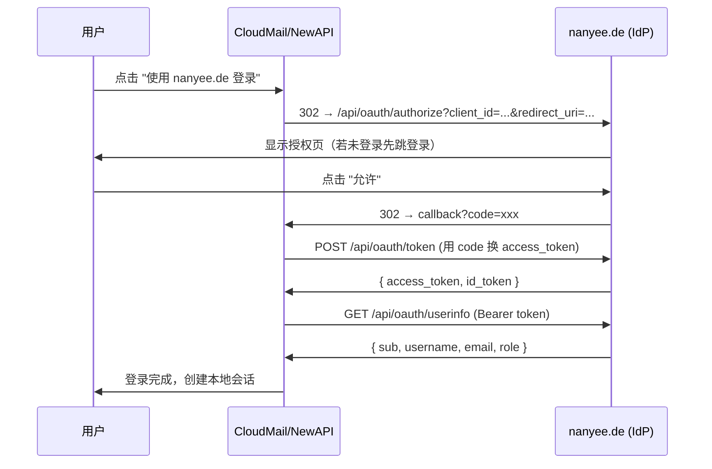

# 统一认证方案：nanyee.de 作为 OIDC Provider

## 背景与目标

当前状态：
- **nanyee.de**：JWT 认证（jose），用户注册/登录/刷新/邮箱验证/答题验证均已实现
- **CloudMail**：Hono on CF Workers，独立 JWT 认证 + 邀请码注册，D1 数据库
- **New API**：Docker 部署，自带用户系统，**原生支持 OIDC 登录**

**目标**：用户在 nanyee.de 注册一次，即可通过 "使用 nanyee.de 登录" 一键登录 CloudMail 和 New API。

---

## 架构设计

```
┌─────────────────────────────────────────────────────┐
│            nanyee.de (OIDC Identity Provider)        │
│                                                     │
│  现有功能不变：注册/登录/邮箱验证/答题验证             │
│                                                     │
│  新增 OIDC 端点：                                    │
│  /.well-known/openid-configuration                  │
│  /api/oauth/authorize    (授权页)                    │
│  /api/oauth/token        (换 token)                 │
│  /api/oauth/userinfo     (用户信息)                  │
│  /api/oauth/jwks         (公钥)                     │
└─────────┬──────────────────────────┬────────────────┘
          │ OIDC                     │ OIDC
          ▼                          ▼
┌──────────────────┐      ┌──────────────────────┐
│   CloudMail       │      │      New API          │
│  mail.nanyee.de   │      │   api.nanyee.de       │
│                   │      │                      │
│  改造：            │      │  配置 OIDC：           │
│  登录页新增        │      │  后台 → 系统设置       │
│  "nanyee.de 登录" │      │  填入 OIDC 端点即可    │
│  按钮              │      │                      │
└──────────────────┘      └──────────────────────┘
```

### 用户体验流程



---

## 实施方案

### 1. nanyee.de 新增 OIDC Provider

#### 方案选择：`oidc-provider` 库

`oidc-provider` 是 Node.js 最成熟的 OIDC 认证库（24k stars，被 Auth0 等使用），完整实现了 OpenID Connect 规范。

> [!IMPORTANT]
> `oidc-provider` 是 ESM-only 模块（v8+），需要确认 Next.js 配置兼容。Next.js 15 默认支持 ESM，但可能需要在 `next.config.ts` 中配置 `serverExternalPackages`。

#### 安装依赖

```bash
npm install oidc-provider
```

#### Prisma Schema 新增

```prisma
// ═══════════════════════════════════════
// OAuth / OIDC
// ═══════════════════════════════════════

// 注册的 OAuth 客户端 (CloudMail, New API)
model OAuthClient {
  id            String   @id @default(cuid())
  clientId      String   @unique          // 如 "cloudmail"
  clientSecret  String                    // bcrypt hash
  name          String                    // 显示名 "CloudMail 邮箱"
  redirectUris  String                    // JSON: ["https://mail.nanyee.de/callback"]
  grants        String   @default("[\"authorization_code\"]") // JSON
  scopes        String   @default("[\"openid\",\"profile\",\"email\"]")
  createdAt     DateTime @default(now())
}

// oidc-provider 存储 (grants, codes, tokens, sessions)
// oidc-provider 需要一个 adapter，我们用 Prisma 实现
model OidcPayload {
  id            String   @id
  type          String                    // Grant, AuthorizationCode, AccessToken, etc.
  payload       String                    // JSON 序列化
  grantId       String?
  userCode      String?  @unique
  uid           String?  @unique
  expiresAt     DateTime?
  consumedAt    DateTime?
  createdAt     DateTime @default(now())

  @@index([type])
  @@index([grantId])
  @@index([expiresAt])
}
```

#### OIDC Provider 配置

```typescript
// src/lib/oidc/provider.ts

import Provider from 'oidc-provider';
import { PrismaAdapter } from './prisma-adapter';
import { prisma } from '../prisma';

const ISSUER = process.env.NEXT_PUBLIC_SITE_URL || 'https://nanyee.de';

export const oidcProvider = new Provider(ISSUER, {
  adapter: PrismaAdapter,
  
  // 从 Prisma 加载客户端
  async findAccount(ctx, id) {
    const user = await prisma.user.findUnique({ where: { id } });
    if (!user) return undefined;
    return {
      accountId: user.id,
      async claims() {
        return {
          sub: user.id,
          username: user.username,
          email: user.email,
          nickname: user.nickname,
          role: user.role,
        };
      },
    };
  },

  claims: {
    openid: ['sub'],
    profile: ['username', 'nickname', 'role'],
    email: ['email'],
  },

  features: {
    devInteractions: { enabled: false }, // 生产环境关闭
  },

  // Cookie 密钥
  cookies: {
    keys: [process.env.OIDC_COOKIE_SECRET || process.env.JWT_ACCESS_SECRET!],
  },

  // Token 有效期
  ttl: {
    AccessToken: 3600,        // 1 小时
    AuthorizationCode: 600,   // 10 分钟
    IdToken: 3600,
    RefreshToken: 30 * 24 * 3600, // 30 天
  },
});
```

#### Next.js API Route 挂载

```typescript
// src/app/api/oauth/[...oidc]/route.ts

import { oidcProvider } from '@/lib/oidc/provider';

// oidc-provider 自己处理所有路由
// 需要把 Next.js Request 转换为 Node.js IncomingMessage
async function handler(req: Request) {
  // 将 OIDC Provider 挂载到 /api/oauth/ 路径下
  // 使用 node:http 适配层
  return oidcProvider.callback()(req);
}

export { handler as GET, handler as POST };
```

#### 授权确认页面

```typescript
// src/app/oauth/authorize/page.tsx
// 当用户跳转来授权时，显示：
// "CloudMail 想要访问你的 nanyee.de 账户"
// [用户名] [头像]  
// 权限：查看你的用户名和邮箱
// [允许] [拒绝]
```

> [!NOTE]
> 具体 OIDC provider 的交互页面（login、consent）需要通过 `interactions` 配置来实现。nanyee.de 已有登录系统，OIDC 的 login interaction 可以复用现有的登录页面。

---

### 2. New API 配置 OIDC

New API 原生支持 OIDC，只需在后台配置：

| 配置项 | 值 |
|:---|:---|
| OIDC Display Name | `nanyee.de` |
| Client ID | `newapi`（在 nanyee.de 注册的） |
| Client Secret | `生成的密钥` |
| Authorization URL | `https://nanyee.de/api/oauth/authorize` |
| Token URL | `https://nanyee.de/api/oauth/token` |
| UserInfo URL | `https://nanyee.de/api/oauth/userinfo` |
| Scope | `openid profile email` |
| Username Claim | `username` |

配置完成后，New API 登录页会出现 "使用 nanyee.de 登录" 按钮。用户通过 OIDC 登录后，New API 自动创建对应用户并分配默认配额。

---

### 3. CloudMail OIDC 改造

CloudMail 运行在 CF Workers 上，需要手动实现 OIDC Client 逻辑（CF Workers 没有现成的 OIDC 库，但协议简单）。

#### 改造范围

| 文件 | 改动 |
|:---|:---|
| `src/server/routes/auth.ts` | 新增 `/api/auth/oidc/login` 和 `/api/auth/oidc/callback` |
| `src/server/index.ts` | 放行 OIDC 回调路由 |
| `src/client/src/pages/Login.tsx` | 新增 "使用 nanyee.de 登录" 按钮 |
| `wrangler.toml` | 新增 `OIDC_CLIENT_ID`、`OIDC_CLIENT_SECRET` 环境变量 |

#### CloudMail OIDC 逻辑（核心代码）

```typescript
// POST /api/auth/oidc/login → 302 重定向到 nanyee.de 授权
auth.get('/oidc/login', async (c) => {
  const state = crypto.randomUUID();
  // 存 state 到 D1 或 Cookie 防 CSRF
  const url = new URL('https://nanyee.de/api/oauth/authorize');
  url.searchParams.set('client_id', c.env.OIDC_CLIENT_ID);
  url.searchParams.set('redirect_uri', `https://mail.nanyee.de/api/auth/oidc/callback`);
  url.searchParams.set('response_type', 'code');
  url.searchParams.set('scope', 'openid profile email');
  url.searchParams.set('state', state);
  return c.redirect(url.toString());
});

// GET /api/auth/oidc/callback → 用 code 换 token → 创建/登录用户
auth.get('/oidc/callback', async (c) => {
  const code = c.req.query('code');
  // 1. POST nanyee.de/api/oauth/token 换 access_token
  // 2. GET nanyee.de/api/oauth/userinfo 获取用户信息
  // 3. 查找或创建本地用户（以 nanyee_id 为唯一标识）
  // 4. 签发 CloudMail JWT
  // 5. 重定向到前端首页
});
```

#### 前端改动

```tsx
// Login.tsx 新增按钮
<button onClick={() => window.location.href = '/api/auth/oidc/login'}>
  🔑 使用 nanyee.de 登录
</button>
```

---

### 4. 预注册 OAuth 客户端

需要在 nanyee.de 数据库中预先注册两个 OAuth Client：

```typescript
// prisma/seed.ts 中添加

// CloudMail 客户端
await prisma.oAuthClient.upsert({
  where: { clientId: 'cloudmail' },
  create: {
    clientId: 'cloudmail',
    clientSecret: await hash('cloudmail-secret-xxx'),
    name: 'CloudMail 邮箱',
    redirectUris: JSON.stringify(['https://mail.nanyee.de/api/auth/oidc/callback']),
  },
  update: {},
});

// New API 客户端
await prisma.oAuthClient.upsert({
  where: { clientId: 'newapi' },
  create: {
    clientId: 'newapi',
    clientSecret: await hash('newapi-secret-xxx'),
    name: 'API 服务',
    redirectUris: JSON.stringify(['https://api.nanyee.de/oauth/oidc/callback']),
  },
  update: {},
});
```

---

## 新增文件清单

| 文件 | 用途 |
|:---|:---|
| `src/lib/oidc/provider.ts` | OIDC Provider 配置与实例化 |
| `src/lib/oidc/prisma-adapter.ts` | oidc-provider 的 Prisma 存储适配器 |
| `src/app/api/oauth/[...oidc]/route.ts` | 挂载 OIDC 端点到 Next.js |
| `src/app/oauth/authorize/page.tsx` | 用户授权确认 UI 页面 |

## 修改文件清单

| 文件 | 改动 |
|:---|:---|
| `prisma/schema.prisma` | 新增 `OAuthClient` + `OidcPayload` 表 |
| `prisma/seed.ts` | 预注册 CloudMail、New API 两个客户端 |
| `.env` / `.env.example` | 新增 `OIDC_COOKIE_SECRET` |
| CloudMail `auth.ts` | 新增 OIDC login/callback 路由 |
| CloudMail `index.ts` | 放行 OIDC 路由 |
| CloudMail `Login.tsx` | 新增 OIDC 登录按钮 |
| CloudMail `wrangler.toml` | 新增 OIDC 环境变量 |

---

## 安全注意事项

1. **Client Secret 加密存储**：OAuthClient.clientSecret 使用 bcrypt 哈希
2. **State 参数防 CSRF**：CloudMail OIDC 流程中必须验证 state
3. **Redirect URI 严格校验**：oidc-provider 自动校验注册的 redirect_uri
4. **HTTPS 强制**：生产环境所有 OIDC 端点必须 HTTPS（Cloudflare 已覆盖）
5. **Token 加密**：oidc-provider 支持 JWE 加密 token，按需启用

---

## Verification Plan

### 自动化测试

nanyee.de OIDC Provider 端点验证（需在开发环境运行）：

```bash
# 1. 确认 OIDC 发现文档可访问
curl http://localhost:3000/.well-known/openid-configuration

# 2. 确认 JWKS 端点
curl http://localhost:3000/api/oauth/jwks

# 3. 完整 Authorization Code 流程测试
# 使用浏览器工具模拟：
#   a. 访问 /api/oauth/authorize?client_id=cloudmail&redirect_uri=...&response_type=code&scope=openid+profile+email
#   b. 登录并授权
#   c. 观察回调 URL 中的 code 参数
#   d. 使用 code 请求 /api/oauth/token
#   e. 使用 access_token 请求 /api/oauth/userinfo
```

### 手动测试（需要部署后测试）

1. **New API OIDC 登录**：
   - 访问 api.nanyee.de → 点击 "使用 nanyee.de 登录"
   - 应跳转到 nanyee.de 授权页 → 允许 → 回到 New API 并已登录
   - 确认 New API 自动创建了用户

2. **CloudMail OIDC 登录**：
   - 访问 mail.nanyee.de → 点击 "使用 nanyee.de 登录"
   - 同上流程 → 确认 CloudMail 创建用户 + 分配邮箱

3. **SSO 体验验证**：
   - 在 nanyee.de 已登录状态下访问 CloudMail OIDC 登录
   - 应跳过登录直接到授权确认页
